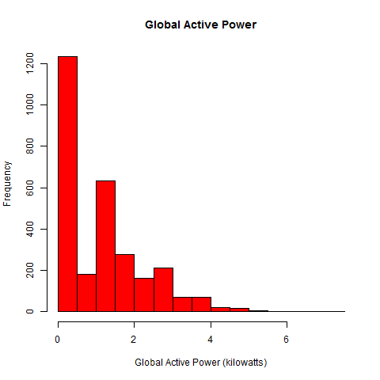
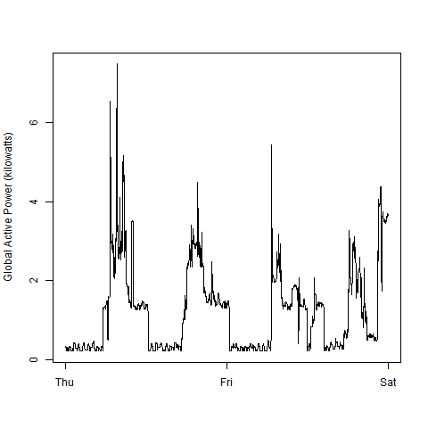
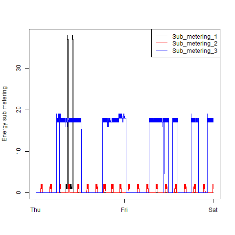
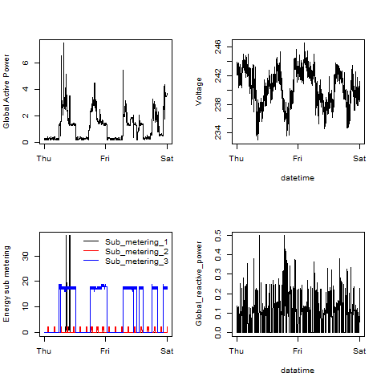

## Introduction

This assignment uses data from
the <a href="http://archive.ics.uci.edu/ml/">UC Irvine Machine
Learning Repository</a>, a popular repository for machine learning
datasets. In particular, we will be using the "Individual household
electric power consumption Data Set" which I have made available on
the course web site:

* <b>Dataset</b>: <a href="https://d396qusza40orc.cloudfront.net/exdata%2Fdata%2Fhousehold_power_consumption.zip">Electric power consumption</a> [20Mb]

* <b>Description</b>: Measurements of electric power consumption in
one household with a one-minute sampling rate over a period of almost
4 years. Different electrical quantities and some sub-metering values
are available.

The following descriptions of the 9 variables in the dataset are taken
from
the <a href="https://archive.ics.uci.edu/ml/datasets/Individual+household+electric+power+consumption">UCI
web site</a>:

<ol>
<li><b>Date</b>: Date in format dd/mm/yyyy </li>
<li><b>Time</b>: time in format hh:mm:ss </li>
<li><b>Global_active_power</b>: household global minute-averaged active power (in kilowatt) </li>
<li><b>Global_reactive_power</b>: household global minute-averaged reactive power (in kilowatt) </li>
<li><b>Voltage</b>: minute-averaged voltage (in volt) </li>
<li><b>Global_intensity</b>: household global minute-averaged current intensity (in ampere) </li>
<li><b>Sub_metering_1</b>: energy sub-metering No. 1 (in watt-hour of active energy). It corresponds to the kitchen, containing mainly a dishwasher, an oven and a microwave (hot plates are not electric but gas powered). </li>
<li><b>Sub_metering_2</b>: energy sub-metering No. 2 (in watt-hour of active energy). It corresponds to the laundry room, containing a washing-machine, a tumble-drier, a refrigerator and a light. </li>
<li><b>Sub_metering_3</b>: energy sub-metering No. 3 (in watt-hour of active energy). It corresponds to an electric water-heater and an air-conditioner.</li>
</ol>

## Loading the data

Data was downloaded as a .zip file and unziped as a .txt file

* Because of the large size of the file only dates starting at 2007-02-01 and
ending with 2007-02-02 will be read into the dataframe

* Column names were added back using a datarame that read in only the first row

* Date and Time variables were converted to Date/Time classes using the
`strptime()` and `as.Date()` functions.

## Making Plots

Our overall goal here is simply to examine how household energy usage
varies over a 2-day period in February, 2007. Your task is to
reconstruct the following plots below, all of which were constructed
using the base plotting system.

Data was forked and cloned from the following GitHub repository:
[https://github.com/rdpeng/ExData_Plotting1](https://github.com/rdpeng/ExData_Plotting1)

R scripts for four plots were created that construct one plot and save
it to a PNG file with a width of 480 pixels and a height of 480 pixels.

Plot files were named as `plot1.png`, `plot2.png`, etc.

Separate R code files were created (`plot1.R`, `plot2.R`, etc.) that
construct the corresponding plot, i.e. code in `plot1.R` constructs
the `plot1.png` plot. 

* R code files include code for unzipping, reading and creating the PNG file,
plotting the graph and closing the PNG file connection. 

* All PNG files and R code files were uploaded to this git repository

The four plots that were constructed are shown below. 

### Plot 1

 

### Plot 2

 

### Plot 3

 

### Plot 4

 

